  

---

## About Me &nbsp; 

I'm a **Systems Engineer** and **Full-Stack Web Developer** specialized in both frontend and backend development.
I love studying and creating projects that integrate **Artificial Intelligence**, and I aspire to become an AI Engineer.
I'm passionate about exploring new technologies, methodologies, and programming approaches to continuously improve my skills.
I also have experience working with agile methodologies such as **XP** and **Scrum**.

 

---

## Frontend &nbsp; 

**Frameworks & Libraries**

| Vue.js | React | Next.js | Bootstrap |
|:---:|:---:|:---:|:---:|
|  |  |  |  |
| Vue.js | React | Next.js | Bootstrap |

**Languages**

| JavaScript | TypeScript | HTML5 | CSS3 |
|:---:|:---:|:---:|:---:|
|  |  |  |  |
| JavaScript | TypeScript | HTML5 | CSS3 |

---

## Backend &nbsp; 

**Frameworks**

| Django | Spring Boot |
|:---:|:---:|
|  |  |
| Django | Spring Boot |

**Languages**

| Python | Java |
|:---:|:---:|
|  |  |
| Python | Java |

---

## Databases &nbsp; 

**Relational**

| PostgreSQL | MySQL |
|:---:|:---:|
|  |  |
| PostgreSQL | MySQL |

**NoSQL**

| MongoDB |
|:---:|
|  |
| MongoDB |

**BaaS**

| Supabase |
|:---:|
|  |
| Supabase |

---

## Cloud and DevOps &nbsp; 

**Cloud & Hosting**

| AWS | Cloudflare | Vercel |
|:---:|:---:|:---:|
|  |  |  |
| AWS | Cloudflare | Vercel |

**DevOps & Version Control**

| Docker | Git | GitHub |
|:---:|:---:|:---:|
|  |  |  |
| Docker | Git | GitHub |

---

## Complementary Skills &nbsp; 

**Additional Languages**

| C# | Kotlin | PHP |
|:---:|:---:|:---:|
|  |  |  |
| C# | Kotlin | PHP | Node.js |

**Hardware & Systems**

| Arduino | Linux | Windows |
|:---:|:---:|:---:|
|  |  |  |
| Arduino | Linux | Windows |

**Project Management & Analytics**

| Jira | Power BI | Selenium |
|:---:|:---:|:---:|
|  |  |  |
| Jira | Power BI | Selenium |
---

*"If you can imagine it, you can program it."* — Alejandro Taboada

